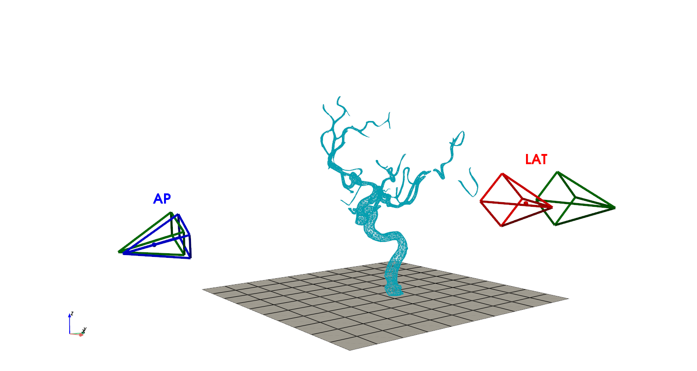
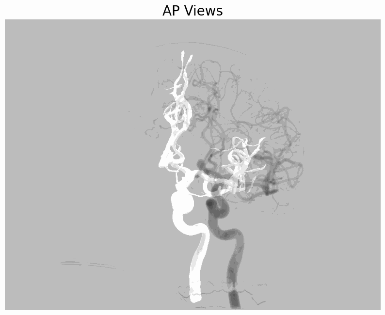
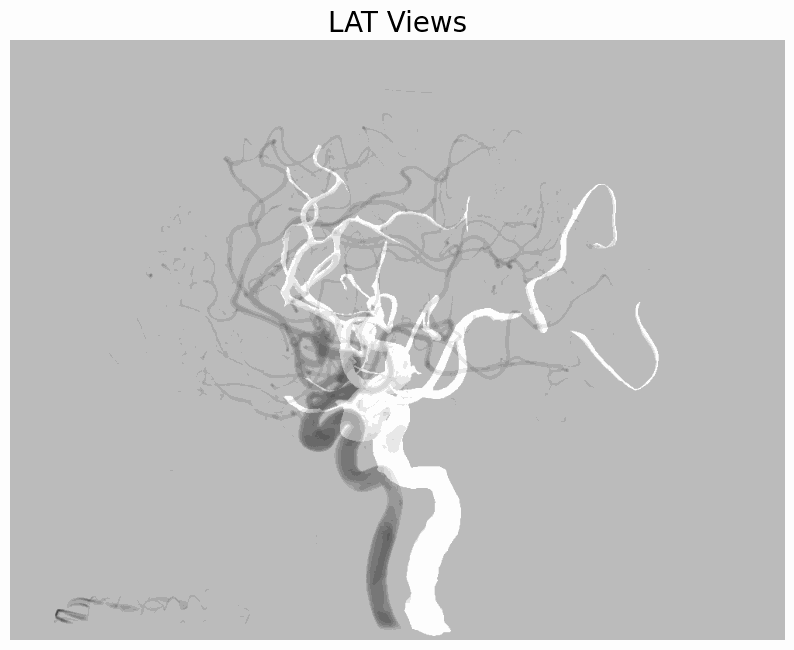
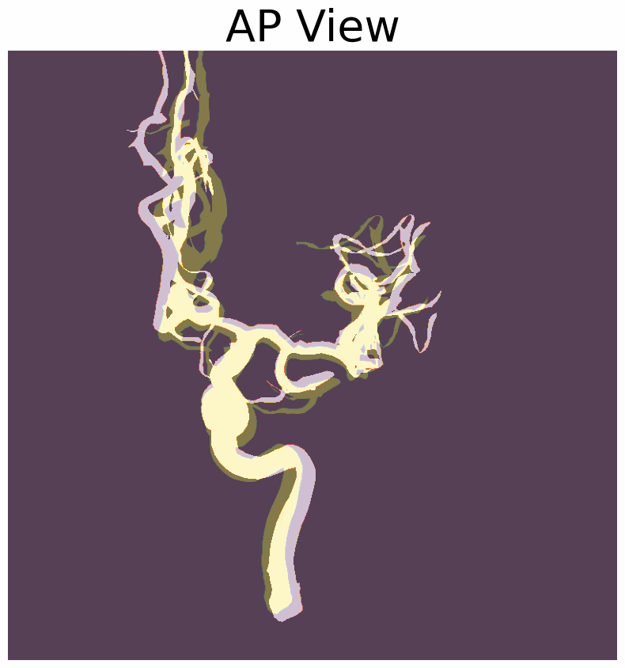
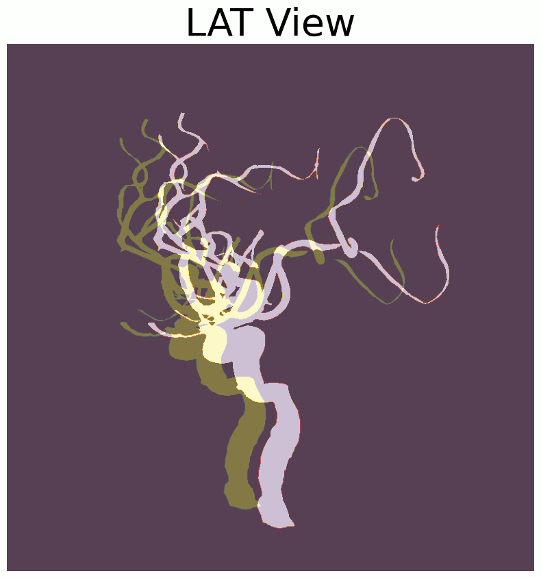

# 3D/2D Registration of Angiograms using Silhouette-based Differentiable Rendering
Registration of a 3D mesh derived from MRA, CTA or 3d DSA onto two images of 2D DSA using silhouette-based differentiable rendering.

<p align="center">
  
  
  
</p>

## Usage
- Inputs: 3D Mesh + Two DSA images, antero-posterior and lateral
- Outputs: Camera pose Rotation and translation

## Citation
If you find this code useful for your research, please cite the following paper (to be submitted):
```
@article{Lee2024,
author = {Taewoong Lee, Sarah Frisken and Nazim Haouchine},
title = {3D/2D Registration of Angiograms using Silhouette-based Differentiable Rendering}
journal={arXiv preprint arXiv:xxxxx},
year = {2024},
}
```

## Librararies
The pose estimation is based on PyTorch3D differentiable rendering. The visualizer is based on PyVitsa.
- Python 3.9.19
- Pytorch 2.3.1
- Pytorch3D 0.7.7
- CUDA 11.8
- PyVista 0.44.1

## Ressources
We used this dataset of paired 3D/2D DSA images: https://lit.fe.uni-lj.si/en/research/resources/3D-2D-GS-CA/

For a differentiable DSA renderer and 3D/2D registration, check [DiffPose by Vivek Gopalakrishnan](https://github.com/eigenvivek/DiffPose)

## Contributing
Pull requests are welcome. For major changes, please open an issue first to discuss what you would like to change.

<p align="center">
  
  &nbsp;&nbsp;&nbsp;&nbsp;&nbsp;&nbsp;&nbsp;&nbsp;&nbsp;
  
  
</p>

